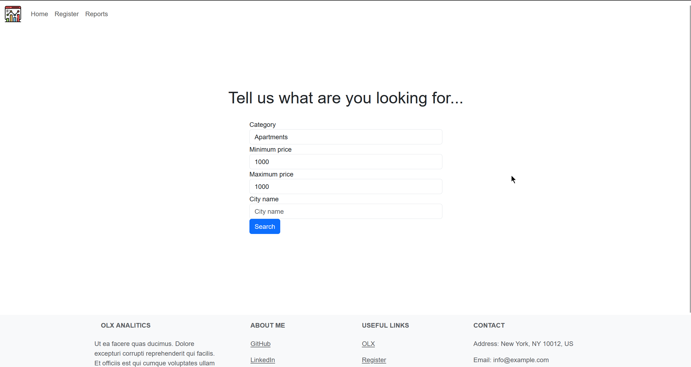
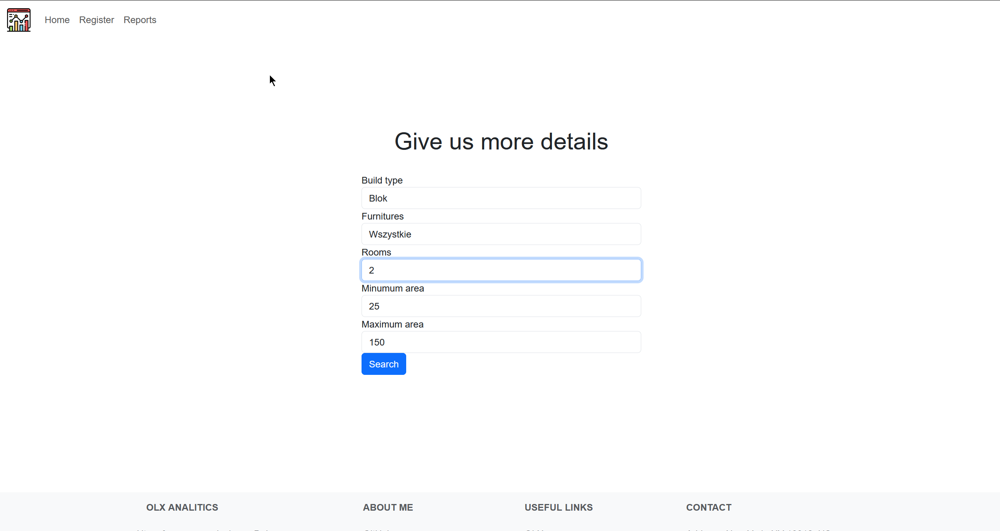
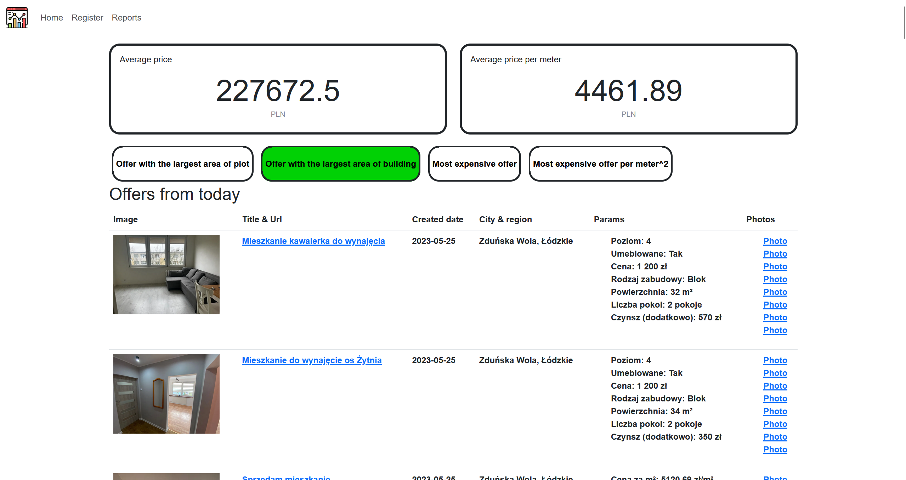
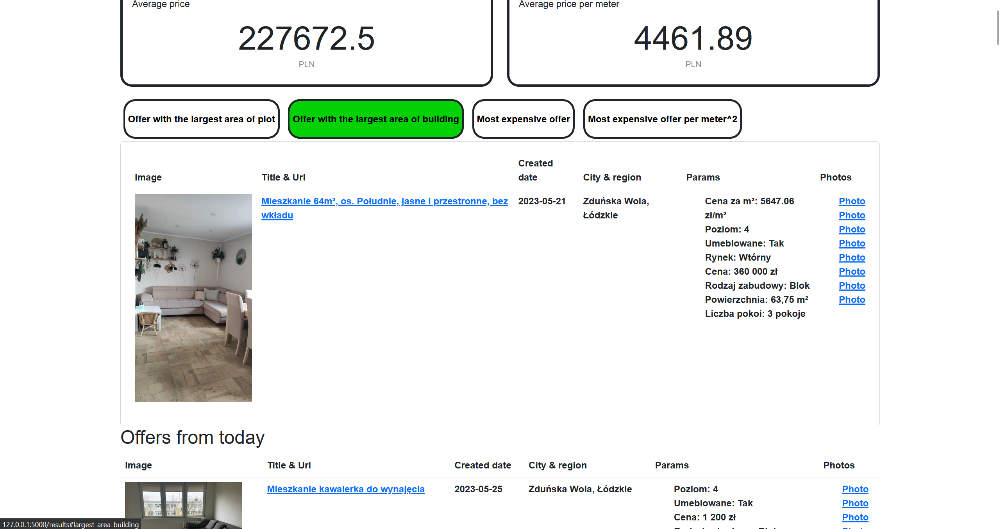
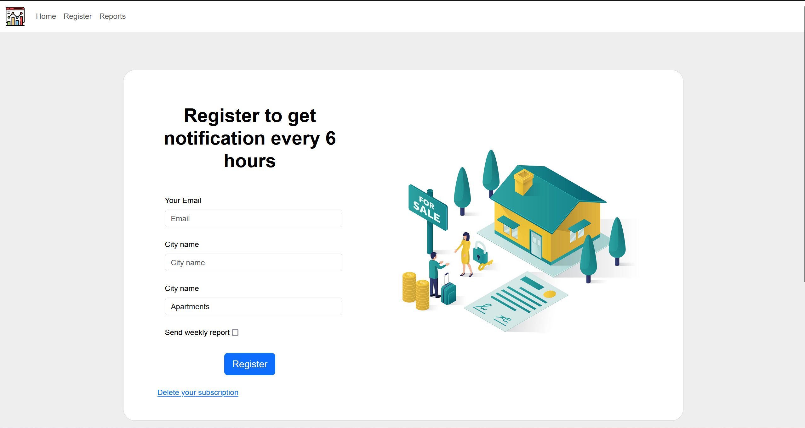
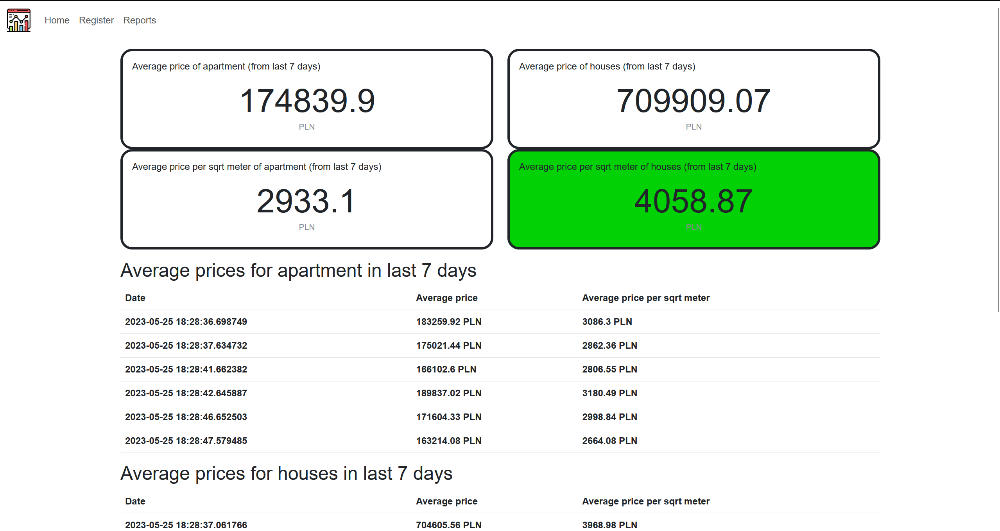

[![Stargazers][stars-shield]][stars-url]
[![Issues][issues-shield]][issues-url]
[![MIT License][license-shield]][license-url]
[![LinkedIn][linkedin-shield]][linkedin-url]


<br />
<div align="center">
  <a href="https://github.com/DEENUU1/">
    
  </a>

  <h3 align="center">OLX Analytics</h3>

  <p align="center">
    Get your dream job in just a few clicks!
    <br />
    <br />
    <a href="http://18.194.184.98:5000/">Online demo</a>
    ·
    <a href="https://github.com/DEENUU1/OLX-Analytics/issues">Report Bug</a>
    ·
    <a href="https://github.com/DEENUU1/OLX-Analytics/issues">Request Feature</a>
  </p>
</div>


<!-- TABLE OF CONTENTS -->

### Table of Contents
  <ol>
    <li>
      <a href="#about-the-project">About The Project</a>
      <ul>
        <li><a href="#built-with">Built With</a></li>
      </ul>
    </li>
    <li><a href="#key-features">Key features</a></li>
    <li>
      <a href="#getting-started">Getting Started</a>
      <ul>
        <li><a href="#installation">Installation</a></li>
        <li><a href="#configuration">Configuration</a></li>
      </ul>
    </li>
    <li><a href="#unit-tests">Tests</a></li>
    <li><a href="#acknowledgments">Acknowledgments</a></li>
    <li><a href="#license">License</a></li>
    <li><a href="#author">Author</a></li>
  </ol>

<!-- ABOUT THE PROJECT -->
## About The Project

- This project allows easy and efficient browsing of classifieds on the OLX portal. 

- The user has the option to register for a subscription and receive the latest information from the category that interests him every 4 hours. 

- This is a significant advantage compared to the OLX portal because it only sends such data once a day In addition, it is possible to receive weekly reports if the user agrees. 

- The website also displays data from reports (average price in the last 7 days) and allows to filtering ads.

### Built With
- Python
- Flask
- HTML & CSS & Bootstrap
- OLX API 
- Docker
- AWS
- SQLite
- APScheduler

## Key Features
  - Searching offers on OLX by categories and other filters
  - Filters to display:
    - the most expensive offer
    - the most expensive offer based on the price per sqrt meter
    - an offer which has the biggest area of the building
    - an offer which has the biggest area of the plot
  - Creating daily reports to the database with average prices from Poland
  - Sending weekly reports to users
  - Sending daily reports to users
  - Sending newest offers every 4 hours
  - Registration to get email reports
  - Deleting a subscription










<!-- GETTING STARTED -->
## Getting Started

### Installation


First, you need to clone this repository
```bash
git clone <link>
```

### Configuration
1. Add a .env file in the 'web' directory
```bash
SECRET_KEY=<SOME SECRET KEY>
EMAIL_USERNAME=<YOUR GMAIL EMAIL>
EMAIL_PASSWORD=<YOUR PASSWORD TO GMAIL>
````
2. Then install all requirements
```bash
pip install -r requirements.txt
```
3. Run the project
```bash
python main.py
```

## Unit tests
To run pytest you need to use this command
```bash
pytest
```

To get Coverage details type this command
```bash
coverage run -m pytest
```


<!-- ACKNOWLEDGMENTS -->
## Acknowledgments

Use this space to list resources you find helpful and would like to give credit to. I've included a few of my favourites to kick things off!

* [Always Check for the Hidden API when Web Scraping](https://www.youtube.com/watch?v=DqtlR0y0suo)


<!-- LICENSE -->
## License

Distributed under the MIT License. See `LICENSE.txt` for more information.


## Author

- [@DEENUU1](https://www.github.com/DEENUU1)


<!-- MARKDOWN LINKS & IMAGES -->
<!-- https://www.markdownguide.org/basic-syntax/#reference-style-links -->
[contributors-shield]: https://img.shields.io/github/contributors/DEENUU1/OLX-Analytics.svg?style=for-the-badge
[contributors-url]: https://github.com/DEENUU1/OLX-Analytics/graphs/contributors
[forks-shield]: https://img.shields.io/github/forks/DEENUU1/OLX-Analytics.svg?style=for-the-badge
[forks-url]: https://github.com/DEENUU1/OLX-Analytics/network/members
[stars-shield]: https://img.shields.io/github/stars/DEENUU1/OLX-Analytics.svg?style=for-the-badge
[stars-url]: https://github.com/DEENUU1/OLX-Analytics/stargazers
[issues-shield]: https://img.shields.io/github/issues/DEENUU1/OLX-Analytics.svg?style=for-the-badge
[issues-url]: https://github.com/DEENUU1/OLX-Analytics/issues
[license-shield]: https://img.shields.io/github/license/DEENUU1/OLX-Analytics.svg?style=for-the-badge
[license-url]: https://github.com/DEENUU1/OLX-Analytics/blob/main/LICENSE
[linkedin-shield]: https://img.shields.io/badge/-LinkedIn-black.svg?style=for-the-badge&logo=linkedin&colorB=555
[linkedin-url]: https://www.linkedin.com/in/kacper-wlodarczyk/
